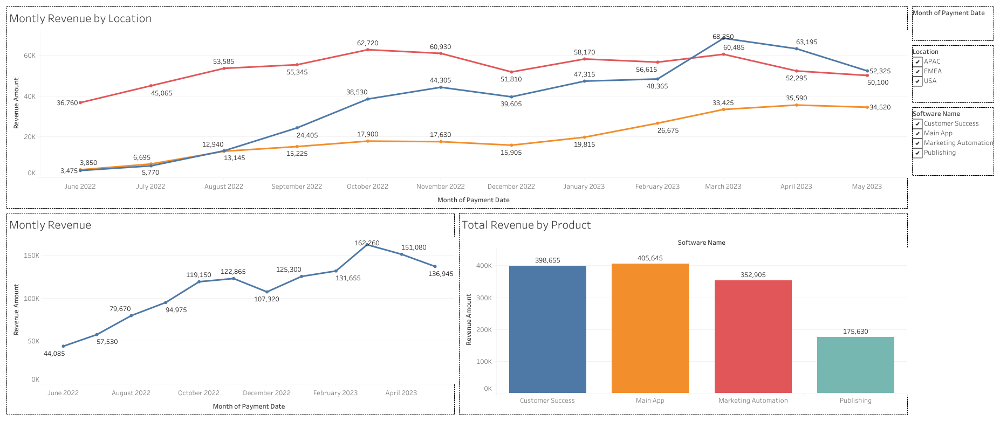
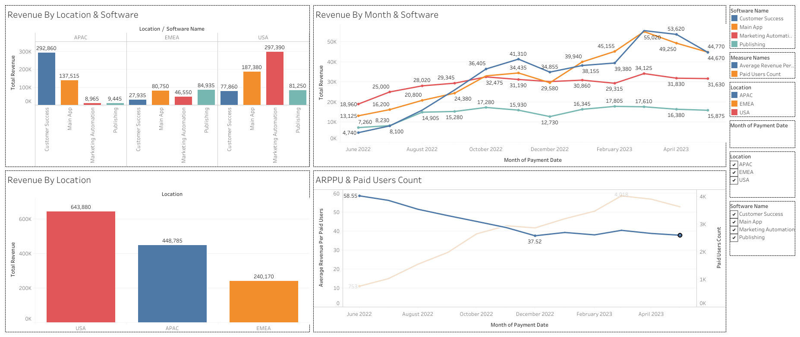
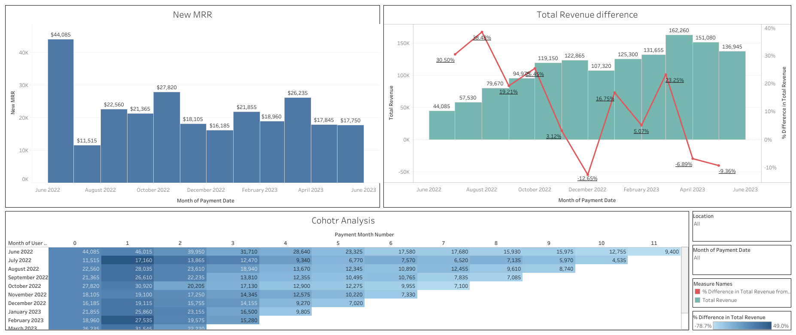

# SaaS Revenue Analytics in Tableau

[](https://public.tableau.com/views/tableau-saas-revenue-analytics/Dashboard_2?:language=en-US&:sid=&:redirect=auth&:display_count=n&:origin=viz_share_link)


An interactive Tableau project that analyzes revenue performance for a SaaS company operating across multiple locations and software products.

The project covers monthly revenue trends, location and product performance, paid-user metrics, New MRR, month-over-month revenue growth, and cohort analysis.

## Live dashboard

**[Open the interactive dashboard on Tableau Public](https://public.tableau.com/views/tableau-saas-revenue-analytics/Dashboard_2?:language=en-US&:sid=&:redirect=auth&:display_count=n&:origin=viz_share_link
)**

## Business objective

The dashboards were created to help a product team answer the following questions:

- How does revenue change over time?
- Which locations generate the most revenue?
- Which software products perform best?
- How many users make payments each month?
- What is the average revenue per paid user?
- How much revenue is generated by newly converted paid users?
- How does revenue change compared with the previous month?
- How does cohort revenue develop after a user's first payment?

## Dashboard previews

### Dashboard  — Revenue Overview

Shows monthly revenue, monthly revenue by location, and total revenue by software product.


The first dashboard provides a high-level overview of the company’s revenue performance. Its main purpose is to help stakeholders quickly understand how total revenue changes over time, how different locations contribute to the overall result, and which software products generate the largest share of income.

The dashboard combines three visualizations:

### Monthly Revenue

This line chart shows the total amount of revenue generated in each month. It helps identify the overall revenue trend, periods of rapid growth, temporary declines, and the month with the highest result.

The visualization makes it possible to answer questions such as:

Is the company’s revenue growing over time?
Which months showed the strongest performance?
Were there any noticeable drops in revenue?
Is the growth stable or volatile?

#### Monthly Revenue by Location

This multi-line chart displays monthly revenue separately for APAC, EMEA, and USA. Each line represents one location, making it possible to compare regional performance over time.

The chart helps stakeholders understand:

which location generates the most revenue;
which regions are growing faster;
whether a revenue decline affects all locations or only one market;
how stable the revenue contribution of each location is.

#### Total Revenue by Product

This bar chart compares the total revenue generated by each software product. It provides a clear ranking of products and helps identify the company’s strongest and weakest revenue sources.

The visualization shows that Main App and Customer Success generate the highest revenue. Marketing Automation also represents a significant part of the company’s income, while Publishing has the smallest contribution.

This information can help management:

prioritize the most profitable products;
identify products that need additional promotion;
review pricing or positioning;
allocate development and marketing resources more effectively.

#Business value of Dashboard 

Dashboard  is designed for management-level monitoring. It provides a quick summary of the company’s financial performance without requiring users to analyze detailed transaction-level data.

It helps stakeholders:

monitor overall revenue growth;
compare regional performance;
identify the most profitable products;
detect unusual monthly changes;
decide which locations or products require deeper analysis.
### Dashboard 2 — Revenue & User Metrics

Compares revenue by location and software, monthly product trends, location totals, ARPPU, and paid-user count.



### Dashboard 3 — MRR & Cohort Analysis

Combines New MRR, total revenue with month-over-month change, and a cohort revenue heat map.



## Dataset

The analysis uses [`data/saas_revenue.csv`](data/saas_revenue.csv).

| Characteristic | Value |
|---|---:|
| Transactions | 123,195 |
| Date range | 2022-06-01 — 2023-05-30 |
| Unique paid users | 8,463 |
| Locations | 3 |
| Software products | 4 |
| Total revenue | 1,332,835 |
| Overall revenue per paid user | 157.49 |

### Source fields

| Field | Description |
|---|---|
| `user_id` | Anonymized user identifier |
| `payment_date` | Transaction date |
| `location` | Customer location: APAC, EMEA, or USA |
| `software_name` | Purchased software product |
| `is_enterprise_customer` | Enterprise customer flag |
| `revenue_amount` | Transaction revenue amount |

## Core metrics

| Metric | Definition |
|---|---|
| **Total Revenue** | Sum of `revenue_amount` |
| **Paid Users Count** | Distinct count of `user_id` |
| **ARPPU** | Total Revenue divided by Paid Users Count |
| **New MRR** | Revenue generated in the same calendar month in which a user made their first payment |
| **Revenue Change** | Percentage change in Total Revenue compared with the previous month |
| **Cohort Revenue Change** | Revenue in a cohort month relative to that cohort's first payment month |

The exact Tableau formulas are documented in [`docs/tableau-calculations.md`](docs/tableau-calculations.md).

## Worksheets

### Revenue overview
- Monthly Revenue
- Monthly Revenue by Location
- Total Revenue by Product

### Segmentation and user metrics
- Revenue by Location & Software
- Revenue by Month & Software
- Revenue by Location
- ARPPU & Paid Users Count

### Advanced revenue analysis
- New MRR
- Total Revenue Difference
- Cohort Analysis

## Filters and interactivity

The dashboards support filtering by:

- `location`
- `software_name`
- month of `payment_date`

The advanced revenue dashboard uses location and payment-date filters. Filters are configured to update the relevant worksheets on each dashboard.

## Key insights

- Total revenue for the analyzed period is **1,332,835** from **123,195 transactions** and **8,463 unique paid users**.
- **USA** is the highest-revenue location with **643,880**, followed by **APAC** with **448,785**.
- **Main App** is the top product with **405,645** in revenue.
- Monthly revenue peaked at **162,260** in **2023-03**.
- Monthly paid users peaked at **4,018** in **2023-03**.
- The strongest month-over-month revenue increase was **38.48%** in **2022-08**.
- The largest month-over-month decline was **-12.65%** in **2022-12**.
- New MRR reached its highest value of **44,085** in **2022-06**.
- Monthly ARPPU declined as the paid-user base expanded, indicating that user growth outpaced average revenue per payer.

## Tableau techniques demonstrated

- Interactive dashboard design
- Dashboard filters
- Line and bar charts
- Clustered bar charts
- Dual-axis charts
- Level of Detail expressions
- Table calculations
- Month-over-month analysis
- Cohort analysis
- Business-focused data storytelling

## Repository structure

```text
tableau-saas-revenue-analytics/
├── README.md
├── LICENSE
├── .gitignore
├── data/
│   ├── README.md
│   └── saas_revenue.csv
├── docs/
│   ├── project-requirements.md
│   └── tableau-calculations.md
├── images/
│   ├── dashboards/
│   │   ├── dashboard-01-revenue-overview.png
│   │   ├── dashboard-02-location-product-users.png
│   │   └── dashboard-03-mrr-growth-cohorts.png
│   └── worksheets/
│       ├── monthly-revenue.png
│       ├── monthly-revenue-by-location.png
│       ├── total-revenue-by-product.png
│       ├── revenue-by-location-and-software.png
│       ├── revenue-by-month-and-software.png
│       ├── revenue-by-location.png
│       ├── arppu-and-paid-users-count.png
│       ├── new-mrr.png
│       ├── revenue-and-monthly-change.png
│       └── cohort-analysis.png
└── tableau/
    └── README.md
```

## How to explore the project

### Tableau Public

Open the published interactive visualization:

**[SaaS Revenue Analytics Dashboard](https://public.tableau.com/app/profile/dmytro.onishchuk/viz/OnishchukHW14_Part2/Dashboard_2)**

### Tableau Desktop or Tableau Public Desktop

1. Download the repository.
2. Open Tableau.
3. Connect to `data/saas_revenue.csv`.
4. Recreate or extend the worksheets using the formulas in `docs/tableau-calculations.md`.

## Author

**Dmytro Onishchuk**

[LinkedIn](https://www.linkedin.com/in/dmytro-onishchuk96/) · [Tableau Public dashboard](https://public.tableau.com/app/profile/dmytro.onishchuk/viz/OnishchukHW14_Part2/Dashboard_2)
